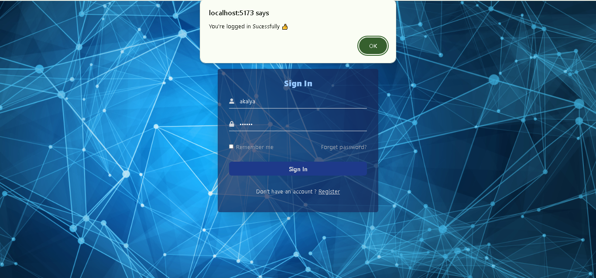

# Login Page

Creating a simple login page using reactJS

## Table of Contents

- [Login Page ](#login-page)
  - [Table of Contents](#table-of-contents)
  - [Description](#description)
  - [Demo](#demo)
  - [Technologies Used](#technologies-used)
  - [Features](#features)
  - [Installation Guide](#installation-guide)
  - [Contributing](#contributing)
  - [License](#license)

## Description

This project is a simple and intuitive login page application built using React.js. It demonstrate the essential feature of form validation, ensuring a smooth login process. Upon successful login, users are navigated to another page that displays detailed customer information..

## Demo

## Technologies Used

- HTML
- Tailwind CSS
- JavaScript
- ReactJS
- Vite

## Features

- Form Validation
- Clean UI
- Responsive design using Tailwind CSS.

## License

MIT

   
